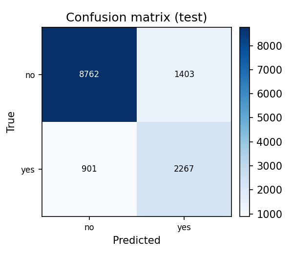
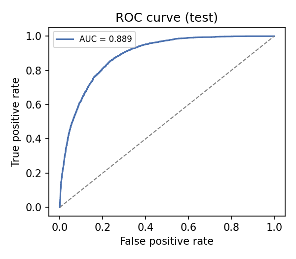

# IN6227-Assignment-1 Variant-2

**[PLACEHOLDER: Enter your full name], [PLACEHOLDER: Enter your matric number]**  
IN6227-Assignment-1

---

## INTRODUCTION

This report presents an end-to-end tabular classification workflow applied to the **train** dataset (31112 rows, 15 features). The target variable is **`label`** with 2 classes: no, yes. Class distribution (train): no=23645, yes=7464, yielding an imbalance ratio of 3.168:1.

The data contains 50 missing values (0.01% of cells). Rows with missing target were dropped (3 dropped); 0 duplicate rows were found. **Column types:** 7 numeric, 8 categorical. The goal is to build a leakage-safe, reproducible classification pipeline and compare multiple models.

## METHODS OR PROCEDURES

### Preprocessing

All learned preprocessing is embedded inside an sklearn `Pipeline` / `ColumnTransformer` so that during cross-validation the imputer, scaler, and encoder are refit on each training fold only — preventing data leakage.

- **Numeric features** (7): median imputation, then standard scaling.
- **Categorical features** (8): most-frequent imputation, then one-hot encoding (`handle_unknown="ignore"`).

No manual feature selection is applied; all 15 original features are retained. No new features are engineered — the data already contains derived fields (e.g. `composite_rank`).

### Models

Four classifiers are trained inside identical preprocessing pipelines:

| Model | Key hyper-parameters |
|---|---|
| DummyClassifier | strategy=stratified (no-information baseline) |
| LogisticRegression | max_iter=1000, class_weight=balanced |
| RandomForest | n_estimators=200, class_weight=balanced |
| GradientBoosting | n_estimators=100, max_depth=3, lr=0.1 |

**Cross-validation:** Stratified 5-fold (`random_state=42`). Model selection uses **mean CV F1**. The best model is then retrained on the full training set and evaluated **once** on the held-out test set — the test set is never used for model selection or tuning. `class_weight="balanced"` is used for LogisticRegression and RandomForest to counter the 3.2:1 class imbalance; SMOTE is intentionally not applied.

## RESULTS

| Model | Accuracy | Precision | Recall | F1 | ROC-AUC | PR-AUC |
|---|---|---|---|---|---|---|
| dummy | 0.6351 | 0.2365 | 0.2337 | 0.2351 | 0.4978 | 0.2391 |
| logistic_regression | 0.7903 | 0.5401 | 0.8493 | 0.6602 | 0.8905 | 0.7049 |
| random_forest **(best)** | 0.8266 | 0.6204 | 0.7146 | 0.6641 | 0.8892 | 0.7058 |
| gradient_boosting | 0.8392 | 0.7083 | 0.5610 | 0.6260 | 0.8913 | 0.7131 |

**Test-set performance (best model: random_forest):** accuracy=0.8272, precision=0.6177, recall=0.7156, F1=0.6631, ROC-AUC=0.8887, PR-AUC=0.7010.

## DISCUSSION

- **Best model:** random_forest, selected by CV F1=0.6641. However, its advantage over LogisticRegression (CV F1=0.6602) was **small** (ΔF1=0.0039); the two models are comparable in discriminative power.
- The Dummy baseline (accuracy≈0.6351, F1≈0.2351) confirms that a no-information classifier performs well below all meaningful models.
- LogisticRegression achieves higher recall (0.849 vs 0.715) at the cost of lower precision (0.540 vs 0.620); if recall on the minority class is prioritised, LogisticRegression may be preferred despite its slightly lower F1.
- `class_weight="balanced"` trades a small accuracy drop for substantially higher minority-class recall versus uniform weighting.
- Test F1 (0.6631) closely matches CV F1 (0.6641), indicating stable generalisation without overfitting.

## CONCLUSION

The SKILL successfully builds a reusable, leakage-safe tabular classification pipeline. RandomForest was selected as the best model by CV F1, though the margin over LogisticRegression was small. All numerical values in this report are pulled directly from `results.json` — none are manually entered.

## REFERENCES

[1] Pedregosa, F. et al. (2011). Scikit-learn: Machine Learning in Python. *Journal of Machine Learning Research*, 12, 2825–2830.

[2] McKinney, W. (2010). Data Structures for Statistical Computing in Python. *Proc. 9th Python in Science Conf.* (pp. 56–61).

[3] Breiman, L. (2001). Random Forests. *Machine Learning*, 45(1), 5–32.

## VITA

**Name:** [PLACEHOLDER: Enter your full name]  
**Matric number:** [PLACEHOLDER: Enter your matric number]  
**Model (LLM):** GLM-5.2  
**LLM interface:** TraeCode (Codex)  
**GitHub:** [PLACEHOLDER: Enter your GitHub repository link]